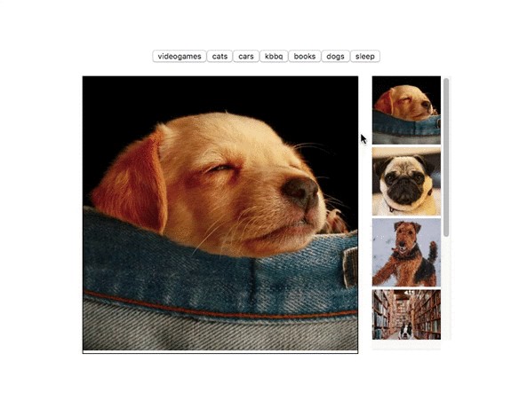

# reactReviewPictureCollection

[](http://nodejs.org/download/)
[](https://www.npmjs.com/get-npm/)

Get additional practice with React by creating a front end application that renders data from an image api.  This will require some knowledge on React

## Preview
Preview of initial and subsequent load times of all 3 services on a single html page



## Getting Started

### Clone
```
  $ git clone https://github.com/omegak911/reactReviewPictureCollection.git
  $ cd reactReviewPictureCollection
```

### Setup
```
  $ npm install
  $ npm start
  $ npm run build
```

If you plan to redo this repo multiple times, make a new branch
```
  $ git checkout -b attempt1
```

When you are ready to try again, repeat as necessary
```
  $ git checkout master
  $ git checkout -b attempt2
```

### Steps
At each step, before moving on, answer the following question: What justifies my expectation that I completed the requirement?  If you cannot justify this, then it means you haven't tested it yet.

#### STEP 1: 
Connect your react app to the browser.  Instead of showing the hard-coded html tag, it should display App.js

#### STEP 2: 
Render all the components + validate that they are all connected properly

#### STEP 3: 
Pass mock image data down to App as props + render said data in ImageDisplay and Collection
  * this may require you to set props to state, do not do this in the constructor
  * set props to your state once your component mounts

#### STEP 4:
Design functionality so that when a function clicks on a CollectionItem, ImageDisplay changes to what the user clicked on.
  * Use the helper function in ImageDisplay to convert the image to 400x400

#### STEP 5:
Pass mock options data dow to ImageFetcher and design ImageFetcher.js such that a user can click on a button, which runs a function that console.log's what the user has clicked on

#### STEP 6:
In ImageFetcher.js, instead of console logging what the user clicked, refactor the code to use axios + https://source.unsplash.com/ and send a request that will return a url for a 100x100 image of a dog
  * hint: google "npm axios" to find out the syntax for a GET request
  * hist: find out how to make a request to this website.  In the response from the site, you'll get the url in something like request.responseURL

#### STEP 7:
As needed, update App.js so that image data received from the API will render on the page in addition to any existing image data
  * remove the mock data

### Advanced
Note: if you're not comfortable with STEPS 1-7, redo STEPS 1-7 instead

#### STEP 8:
Create a new feature.  Example: like/dislike counter for each image

#### STEP 9:
Add css, have fun.

#### STEP 10:
Only allow 5 images to be rendered inside of Collection.js

#### STEP 11:
Create feature to add new buttons

#### STEP 12:
Refactor application to use Redux or Context API instead of passing props down manually

### Solutions
Once you are done with steps 1-7, solution code is available on branch solution1
```
  $ git checkout solution
```

### Acknowledgments
 * https://source.unsplash.com/
